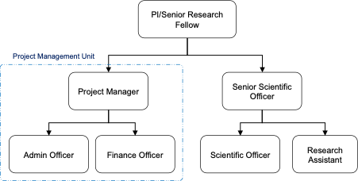

```{r setup, include=FALSE}
knitr::opts_chunk$set(echo = TRUE)
```


# MalCon {-}

As part of the Global Fund supports since 2008, the Papua New Guinea Institute of Medical Research (PNGIMR) has established the malaria control section (MalCon) under its Population Health and Demography Unit (PHDU) that conducts a range of operational research and evaluation activities in support of the National Malaria Control Program (NMCP). These activities contribute to generating evidence on the outcome and impacts of the Global Fund supported malaria control activities and inform the NMCP on the dynamics of malaria epidemiology across PNG and better malaria control intervention strategies. 

Since 2008, MalCon has been conducting a series of two repeated countrywide cross-sectional surveys, namely, Health facility survey (HFS) and malaria indicator survey (MIS). Five rounds of HFS have been completed to date: two In the two years (2010, 2011) prior to the implementation of the new National Malaria Treatment Protocol (NMTP) and three afterwards (2012, 2014, 2016). Another round is conducted in 2021-2022 and still ongoing. 

In the frame of the continuous comprehensive evaluation of the NMCP, MalCon has also accomplished five rounds of MIS between 2008 and 2020 and the sixth round is planned to commence in mid 2022.  

## Disclaimer

This document has been written for the staff in the Malaria Control section (MalCon) at PNGIMR. As a result, it includes MalCon-specific terms and refers to internal documents that are only accessible to MalCon staff. As these procedures have been prepared for the use of MalCon staff, other users may require authorisation or caveats may apply. Any use by other members of PNGIMR is at their own risk and MalCon disclaims all liability for any risk.

Also note that this is a working document and still in development phase. 


# Purpose and Scope 

The surveys and other activities undertaken by the MalCon involves regularly recurring field operations which will benefit from standardizing the procedures and processes involved. It would largely benefit the MalCon project to develop a clear and guiding standard operating procedure manual as a reference document for the management of these field operations as well as for scientific technical activities. 

Hence, this document is comprised of two major sections: Managment SOP and technical SOP. 

# Management SOP

This section describes various aspects of the MalCon Project in terms of management, project timeline, and delivery of outcomes. 

## Team structure 

The team comprised of the following members:  

* Senior Research Fellow (SRF) x 1 
* Senior Scientific Officer (SSO) x 1 
* Survey team 
    + Scientific Officer (SO) x 1
    + Research Assistant (RA) x 1
    + Nursing Officer (NO) x 2 for implementing malaria indicator survey  [<<<--- check if this is correct! --->>>]
    + Driver x 1 [as needed]
* Project Management team 
    + Project Manager (PM) x 1
    + Finance Officer (FO) x 1
    + Admin Officer (AO) x 1

```{r, echo=FALSE, out.width="100%", fig.cap="Structure of the MalCon Team"}

```

## Roles and Responsibilities

Roles and responsibilities of each position at MalCon are described below. 

### Senior Research Fellow
SRF is the immediate supervisor to PM and SSO. 

**Research**:

* Lead the design of research activities including the development of study protocols, standard operating procedures, and data collection tools, activities include a country-wide Malaria Indicator Survey and operational research studies on specific topics related to local malaria control efforts
* Lead the analysis, synthesis, and communication of research findings to diverse stakeholders
* Disseminate findings through high-quality presentations, reports, and publications in peer-reviewed scientific journals

**Management and coordination**:

* Manage a team of researchers and support staff towards achieving project deliverables
* Coordinate research activities with other groups at the PNGIMR and collaborating institutions
* Ensure regular communication and timely reporting to the principal recipient of the Global Fund grant
* Maintain a regular exchange with the PNG National Malaria Control Programme and contribute to providing the scientific evidence base for programmatic decision making
* Contribute to capacity building

### Project Manager

PM is the immediate supervisor to PMU staff (AO, FO, and drivers) and responsible for planning, managing, and coordinating a variety of research activities of the Malaria Control project under the supervision of the Senior Research Fellow (SRF). The work involves coordinating project management unit (PMU) to support research activities, maintain workflows, develop, and implement strategies that will ensure compliance, consistency, and accountability in all assigned research activities. PM also interact with internal staff, Principal Recipient (PR), and other relevant stakeholders, and requires good judgment and decision making which directly affects all aspects of the projects and related funding.

**Key responsibilities**:

* Day-to-day oversight and management of PMU to support various research activities
* Scheduling and facilitating research team meetings and conference calls. Preparing status reports for key stakeholders. Depending on project needs, reports may include information about project timelines, status of deliverables, and/or resources requirements. 
* Manages the project budgeting and reporting related to administration and finance
* Assuring project teams meet deadlines and maintaining an ongoing working relationship with research team, internal staff, and project stakeholders
* Works collaboratively with Rotary Against Malaria (RAM) team to ensure alignment with PNGIMR policies, plans and strategies and the effective delivery of research activities of the Malaria Control project
* Represent PNGIMR and Malaria Control Project in management meetings by stakeholders.

### Senior Scientific Officer 
SSO is immediate supervisor of survey teams (SO and RA). SSO ensures the successful implementation of project activities and meets all the deadlines required by the funders. 

**Key responsibilities**:

* Undertake the implementation of various research activities of Malaria Control project and ensure the successful delivery of such activities under the supervision of SRF
* Carry out administrative tasks associated with specified research funding, for example risk assessment of research activities, gaining and maintaining appropriate local research ethics approval and reporting according to research governance guidelines, organization of project meetings and documentation, implementation of procedures required to ensure accurate and timely formal reporting and financial control
* Supervise the works of SO and RA and provide trainings to staffs
* Contribute/Assist SRF with data analysis, interpretation, reporting, and paper writing
* Establishes and maintains close links with NDoH, Provincial Health Authorities, Global Fund and other stakeholders
* Establishes excellent and collaborative relationships with internal and external stakeholders
* Works with the SRF and other partners on monitoring and reporting against budgets, targets, and performance indicator
* Participate and contribute to relevant technical working meetings

### Scientific Officer 
SO is the immediate supervisor of RA and driver if relevant. SO is responsible for conducting survey research in schools in highlands provinces and communities as part of the national malaria control program evaluation. It covers community relations as well as administrative, organisational, and scientific aspects of the survey research process.

**Key responsibilities**:

* Participate in the sensitization program with relevant stakeholders for the school malaria survey 
* Participate in data entry for reliable data sources in preparation for the school malaria survey
* Identify, communicate, schedule, and monitor project activities
* Identify and suggest strategies to mitigate or minimise potential obstacles and/or risks to the achievement of project goals
* Monitor budget and expenditure of designated activities
* Participate in all aspects of field work activity as commissioned by the project manager/SRF
* Carry out questionnaire-based interviews with community members, schools and health facility staff
* Maintain a system for storing and transporting data collection forms and samples
* Establish and maintain good working relations with collaborators in health facilities, schools and with village leaders and communities
* Implement and monitor data collection processes
* Organise schedules for field data collection and participate in the field work
* Ensure timely data entry and transfer of data collected
* Participate in processing and analysing of data collected
* Provide project reports to SRF/project manager including progress reports, expenditure reports, and narrative reports
* Always comply with IMR's policy and best practice guidelines for occupational health and safety in the workplace
* Attendance at Work
* Other duties as required


### Research Assistant 

RA is responsible for assisting or conducting survey research in health facilities or communities as part of the national malaria control program evaluation.


**Key responsibilities**:

* Participate in all aspects of field work activity as commissioned by the supervisor and field team leader
* Carry out questionnaire-based interviews with community members and health facility staff
* Maintain a system for storing and transporting data collection forms and samples 
* Establish and maintain good working relations with collaborators in health facilities, and with village leaders and communities
* Comply with record management systems
* Participate in processing and analysing of data collected as required
* Identify potential obstacles to the achievement of the project goals and suggest strategies for their mitigation 
* Always comply with IMR's policy and best practice guidelines for occupational health and safety in the workplace.
* Attendance at work
* Other duties as required


### Driver

add JD for driver


# Technical SOP 

## Health Facility Survey (HFS)


## Malaria Indicator Survey (MIS) 

A nation-wide malaria indictor survey (MIS) is carried out in Papua New Guinea (PNG) every two years to evaluate the outcome and impact of the malaria control measures using specific indicators. 


### Village sampling methods

MIS report in 2018 shows a difference in malaria prevalence between the surveyed villages below and above 1600 meters, 7.1% and 0.9%, respectively. A well-documented observation in PNG is that altitude shapes malaria distribution. Therefore, it is recommended to sample more villages in low altitudes within the seven Highlands provinces.

This section describes procedures to generate three lists of randomly selected villages (main list and two backups) based across four altitude contours: < 800 meters, 800-1600 meters, 1600-2400 and <2400 meters.

**Procedures** 

1. *Sampling frame*: Census units reported in the 2011 census list are used as the sampling frame for the stratified sampling of villages. Each row in the excel sheet of the 2011 census classifies census units by corresponding columns of: ward name, LLG, district, province, longitude, latitude, total females, total males, number of households and total population.  We projected the population of these villages in 2019, using provincial growth rates provided by the National Statistics Office (NSO). 

2. *Altitude and sampling frame*: To identify altitude of villages in the sampling frame, we used ArcGIS to generate contour maps for PNG. Hence, raster data of Global 3D elevation model from the TanDEM-X, German aerospace center (DLR) were previously obtained, processed and corrected using spatial tools in ArcGIS. Four thresholds of contours were combined into one map: <800m, 800-1600m, 1600-2400m, and >2400m. In addition, Spatial joining tool of ArcMap was used to link the villages (census units) in the sampling frame with their contours using option "closest". 

3. *Sampling of villages*: An Excel sheet including 24,443 records of census units was generated as the final sampling frame to select the villages. A column of random numbers was generated using Rand function in Excel. The 22 categories of provinces were generated. Random numbers of rows for each category were ranked using the following Excel equation: 1+SUMPRODUCT(($AA$2:$AA$13310=AA2)*($AB$2:$AB$13310>AB2)). 

4. *Main list and backups*: For each of the 22 categories of provinces, a maximum of five villages per list was filtered using the ranked column. In addition,in the seven Highlands provinces, we filtered villages below 800m and selected another seven villages. A total of 117 selected villages was generated per list. 54% and 19% of selected villages lie in altitudes <800m and 1600-2400m, respectively. See Table 1 and Table 2.

5. *Feasibility of surveying the villages*: Accessibility of selected villages was verified using relevant data provided by Rotarians Against Malaria (RAM) for the distribution of bed nets. Among the main list, 58.4% and 17.1% of selected villages are accessible by road and trekking, respectively. Beside the Islands provinces that require flights of the survey teams, 20% of the villages in the main list needs travel by boats to access. See Table 3.

6. *Maps*: Distribution maps for selected villages by list are shown in Figures 1-3. The map shows clustering of some selected villages in parts of some provinces. Table 4 shows villages of the main (1st) list. In addition, the lists are contained in the attached excel file.


